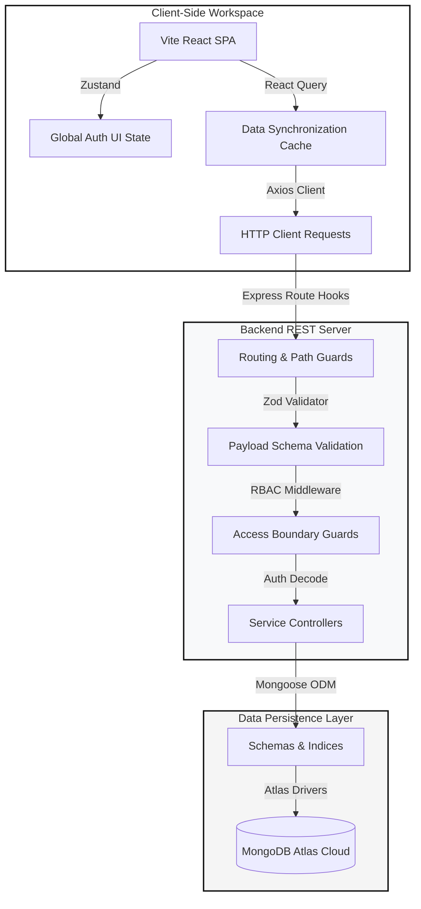

# 🚀 GigFlow — Smart Leads Operations Platform

[](https://www.typescriptlang.org/)
[](https://react.dev/)
[](https://tailwindcss.com/)
[](https://nodejs.org/)
[](https://www.docker.com/)

**GigFlow** is a premium, high-density, typography-first Sales Operations and Lead Management platform. Engineered with a strict MERN stack under Clean Architecture principles, GigFlow is inspired by the sleek monochrome, white-canvas design language defined by the Cal.com design system.

---

## 🏗️ Clean System Architecture

GigFlow strictly decouples the client side, server business layers, and data layers to achieve perfect horizontal scaling and complete type-safety.



---

## ✨ Primary Core Features

1. **🔐 Multi-Role Auth Systems**: Secure registration, dynamic JWT login, and robust routing guards (`ProtectedRoute.tsx` and `RoleGate.tsx`).
2. **👥 Role-Based Access Control (RBAC)**:
   * **Sales**: Operates in isolated workspaces. Can only perform CRUD operations on leads they personally created.
   * **Admin**: Has absolute global access to view, edit, update status/source, and delete any lead in the pipeline, with active creator attribution tracking.
3. **📋 Lead Lifecycle CRM**: Real-time CRUD capabilities supporting state transitions (`New`, `Contacted`, `Qualified`, `Lost`) and lead attribution.
4. **🔍 Advanced Compound Multi-Filtering**: Dynamic combined search (text checking name and email) with debounced state inputs alongside status, source, and sort filters.
5. **📄 High-Performance Pagination**: Strict backend skip/limit paging providing rich navigational metadata back to client lists.
6. **📥 Client-Side CSV Export**: Dynamic, single-click JSON-to-CSV compilation matching active workspace filters.
7. **⚙️ Admin Control Panel**: Live node database KPI monitors, security controls, dynamic user management lists, and rate limiters.

---

## 🛠️ Technology Specs

| Segment | Technology Stack | Key Purpose |
| :--- | :--- | :--- |
| **Core UI** | React 18 / TypeScript | Presentation, component tree |
| **Styling** | TailwindCSS v4 / Google Inter | Cal.com design, fluid typography, negative tracking |
| **Client State** | Zustand / Zustand Persistent | Lightweight UI store & auth sessions |
| **Sync Caches** | `@tanstack/react-query` | Dynamic server state synchronization & caching |
| **API Server** | Node.js / Express.js / TypeScript | High-performance request routing |
| **Validation** | Zod | Dual-layer client-form & server-endpoint verification |
| **Database** | MongoDB / Mongoose | Scalable schematized document storage |
| **Security** | Helmet / Bcrypt / JWT / Rate Limit | HTTP hardening, password hashing, and DoS mitigation |

---

## 📁 Repository Directory Hierarchy

```text
gigflow/
├── client/                     # Vite React SPA Client App
│   ├── src/
│   │   ├── api/                # API fetch clients (Axios)
│   │   ├── components/         # Reusable UI elements (Button, Badge, Modals)
│   │   ├── hooks/              # Custom hook abstractions (useDebounce, useLeads)
│   │   ├── pages/              # Primary Workspace Views (Dashboard, Leads, Settings)
│   │   └── store/              # Global Zustand state controllers
│   └── Dockerfile              # Multi-stage production Nginx compiler
├── server/                     # Express REST API Server App
│   ├── src/
│   │   ├── controllers/        # Request handling logic flow
│   │   ├── middleware/         # Auth decoding, RBAC, and schema validation
│   │   ├── models/             # Mongoose DB schema definitions
│   │   ├── validators/         # Zod API endpoint payload validation rules
│   │   └── e2e-test.ts         # Non-browser Terminal integration test suite
│   └── Dockerfile              # Multi-stage optimized Node runtime compiler
└── docker-compose.yml          # Network-isolated cluster orchestration
```

---

## 🚀 Instant Quick Start

### 1. Environment Configurations
Clone this repository and create your local environment file in the root directory:
```bash
cp .env.example .env
```
Ensure that the `.env` contains a valid `MONGO_URI` pointing to your MongoDB instance (or Atlas Cluster).

---

### 2. Run with Docker (Recommended)
GigFlow comes with an optimized Docker orchestration script that builds production-level multi-stage images, spins up services, and binds virtual networks automatically:

```bash
# Compile and launch the containerized stack
docker compose up --build
```
* **Dashboard client**: `http://localhost:5173`
* **API Server host**: `http://localhost:5050`

---

### 3. Run Locally (Natively)

#### **1. Database**
Make sure your `.env` contains a valid, reachable MongoDB connection string.

#### **2. Start the Backend API**
```bash
cd server
npm install
npm run dev
```

#### **3. Start the Frontend Client**
```bash
cd client
npm install
npm run dev
```

---

## 🧪 Terminal-Based E2E Integration Tests (Non-Browser)

GigFlow includes a native, non-browser integration test suite that tests the REST API endpoints, JWT authentication, RBAC boundaries, and workspace data isolations directly in the console.

To execute the test suite:

```bash
# 1. Spin up the docker environment (detached mode)
docker compose up -d

# 2. Run the integration test suite
npm run --prefix server test:e2e
```
